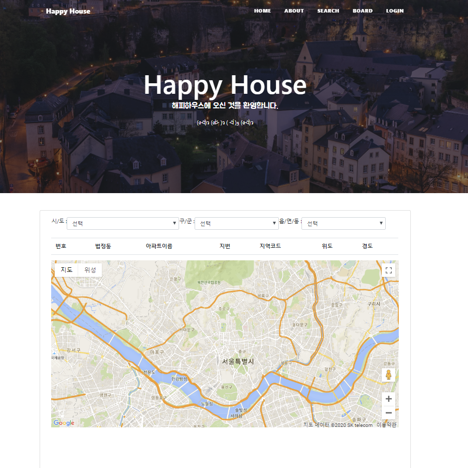

 
# 관통프로젝트: HappyHouse_Web_Frontend_서울_14반_유현진_최은정_최은화 

### 제출일: 2020.06.01

### 참여 페어
- 유현진, 최은정, 최은화

### 처리된 요구사항 목록
  
|난이도|구현기능|세부기능|작성여부|캡쳐|
|:---:|:---:|:---:|:---:|:---:|
|기본|메인페이지||O|O|
|기본|회원관리|회원정보 등록화면|O|O|
|기본|회원관리|회원정보 수정화면|O|O|
|기본|회원관리|회원정보 삭제화면|O|O|
|기본|회원관리|회원정보 검색화면|O|O|
|기본|로그인/로그아웃|로그인|O|O|
|기본|로그인/로그아웃|로그아웃|O|O|
|기본|실거래가 검색,결과|전체검색화면|O|O|
|기본|실거래가 검색,결과|상세검색화면|O|O|
|기본|실거래가 검색,결과|동별화면|O|O|
|기본|실거래가 검색,결과|아파트별검색화면|O|O|
|추가|비밀번호 찾기/사이트맵/메뉴구성 화면|비밀번호찾기화면|O|O|
|추가|비밀번호 찾기/사이트맵/메뉴구성 화면|사이트맵구현|X|X|
|추가|비밀번호 찾기/사이트맵/메뉴구성 화면|메뉴구성|O|O|
|추가|관심지역 동네 업종 정보||X|X|
|추가|관심지역 대기오염 정보||X|X|
|심화|웹사이트 소개/공지사항 관리 화면|웹사이트 소개|O|O|
|심화|웹사이트 소개/공지사항 관리 화면|공지사항 관리 화면|O|O|
|심화|QnA게시판|QnA게시판 관리 화면|O|O|
|기본|QnA게시판|QnA게시판 등록화면|O|O|
|기본|QnA게시판|QnA게시판 수정화면|O|O|
|기본|QnA게시판|QnA게시판 삭제화면|O|O|
|기본|QnA게시판|QnA게시판 검색화면(+상세검색)|O|O|

### Diagram

TODO: usecase Diagram를 캡쳐해서 추가하세요

- 하우스딜 usecase Diagram

- 유저 usecase Diagram

TODO: class Diagram

-유저 클래스 다이어그램

-하우스딜 클래스 다이어그램

-공지사항 클래스 다이어그램

### 실행화면 캡쳐 - 
TODO: 요구사항 목록에서 완료 처리된 사항의 캡쳐 이미지를 등록하세요.

#### - 메인화면

#### - 회원관리
- 회원정보 등록화면

- 회원정보 조회화면

- 회원정보 수정화면

- 회원탈퇴화면

#### - 로그인/로그아웃
- 로그인 화면

- 로그아웃

#### - 실거래가 검색,결과
- 전체검색화면

- 상세검색화면

- 동별검색화면

- 아파트별검색화면

#### - 비밀번호 찾기/메뉴구성 화면
- 비밀번호 찾기

- 메뉴 구성

#### - 공지사항관리 화면
- 공지사항 목록(유저)

- 공지사항 목록(관리자)

- 공지사항 조회(유저)

- 공지사항 조회(관리자)

- 공지사항 등록

- 공지사항 수정

- 공지사항 삭제

#### - 공지사항관리 화면

- QnA게시판 목록

- QnA게시판 검색

- QnA게시판 등록

- QnA게시판 수정/ 답글달기

- QnA게시판 삭제

#### - 소개 화면
-About 페이지

